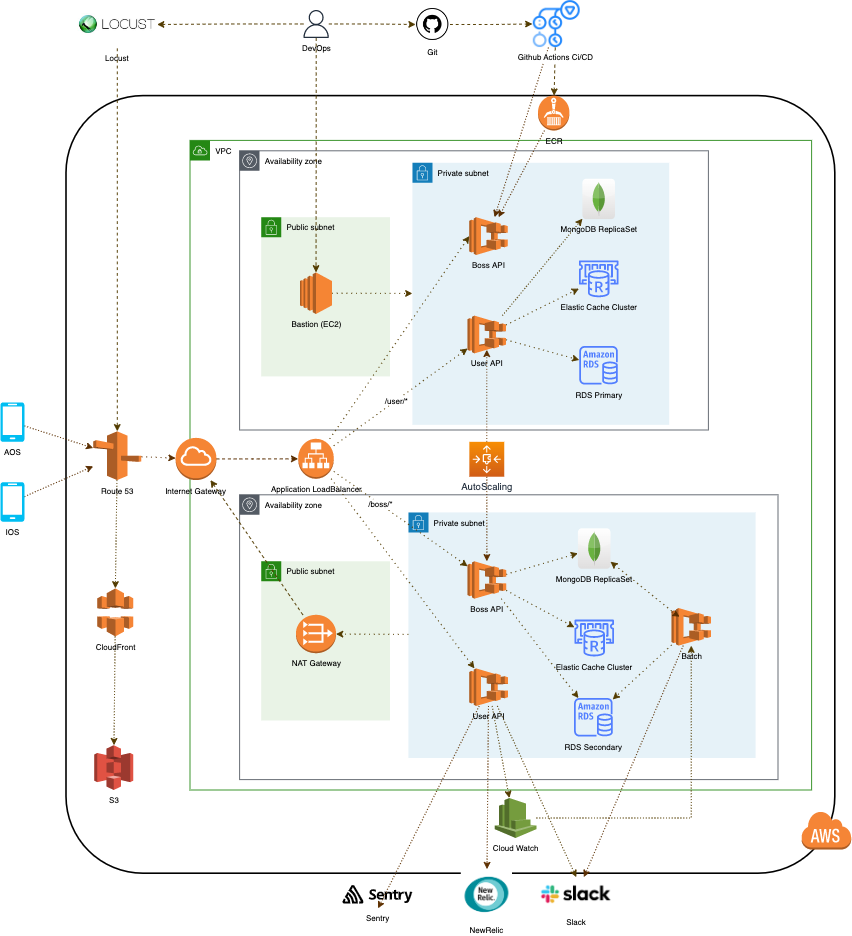

# 가슴속 삼천원 백엔드

### 프로젝트 설명

전국 붕어빵 등 길거리 음식을 파는 곳을 알려주는 [**가슴속 3천원**](https://intro.threedollars.co.kr/)

**"가슴 속 3천원"** 은 겨울철 우리 가슴속에 지니고 다니는 3천원을 털어가는 붕어빵, 문어빵, 계란빵, 호떡 등을 파는 곳을 포함해 길거리 음식점들을 알려주는 사용자 기반 서비스입니다.

### 앱 다운로드

- [AppStore](https://apps.apple.com/kr/app/%EA%B0%80%EC%8A%B4%EC%86%8D3%EC%B2%9C%EC%9B%90-%EB%82%98%EC%99%80-%EA%B0%80%EA%B9%8C%EC%9A%B4-%EB%B6%95%EC%96%B4%EB%B9%B5/id1496099467)
- [PlayStore](https://play.google.com/store/apps/details?id=com.zion830.threedollars)

    
    

## 기술 스택

- **Language**: Java 11 / Kotlin 1.6
- **Framework**: Spring Boot / Spring MVC / Spring Batch
- **Data(RDBMS)**: JPA(Hibernate) / QueryDSL / MariaDB / flyway
- **Data(NoSQL, Cache)**: MongoDB / Redis / Caffeine Cache
- **Test**: Junit5 / Spring Test 
- **Build tool**: Gradle
- **Infra**: ECS Fargate / ALB / RDS / Elastic Cache / EC2 / S3 / CloudFront
- **CI/CD**: Git, Github Actions
- **Operations**: CloudWatch, NewRelic, Sentry, Slack, Locust 

### 멀티 모듈 구조

## Developers & Contacts

- will.seungho@gmail.com (백엔드 개발자, [강승호](https://github.com/seungh0))
- 3dollarinmypocket@gmail.com (가슴속 삼천원 대표 메일)
