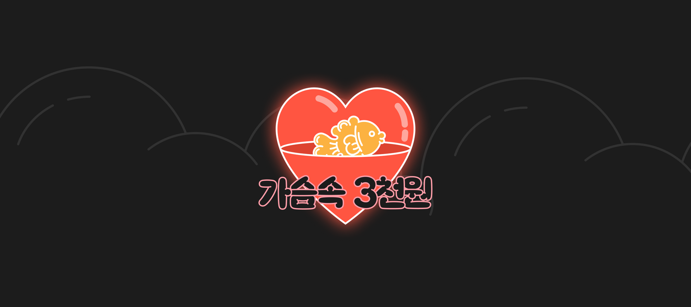
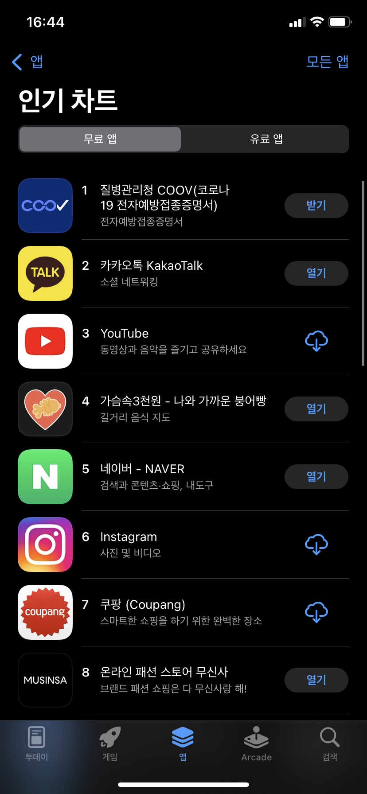
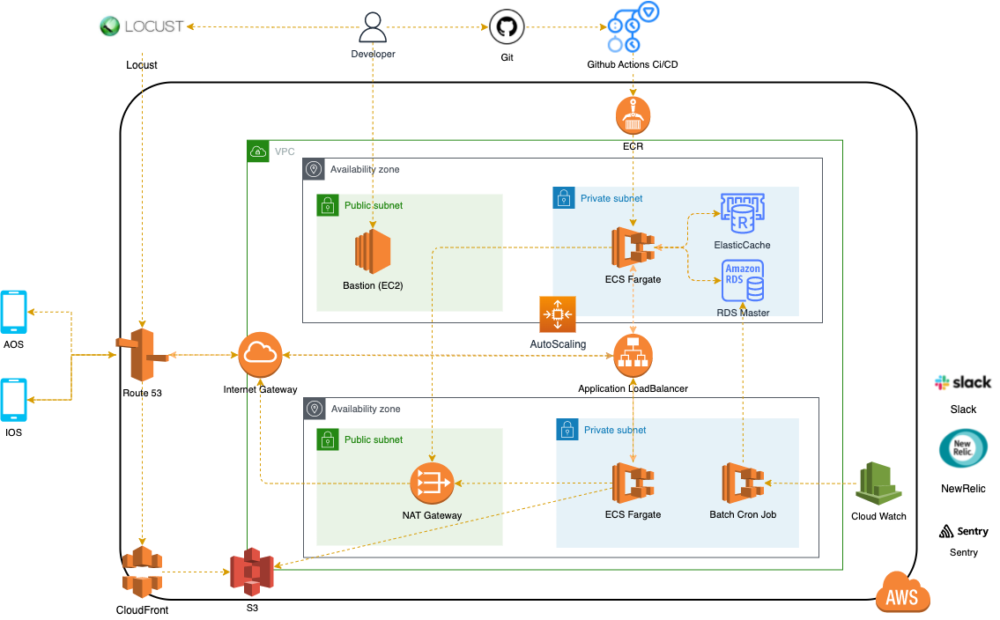
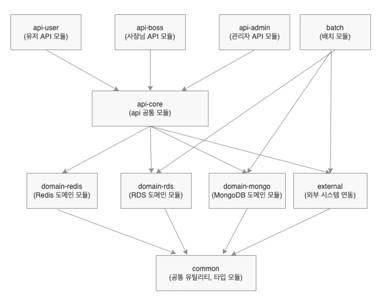

# 가슴속 삼천원 백엔드

### 프로젝트 설명
전국 붕어빵파는 곳을 알려주는 [**가슴속 3천원**](https://intro.threedollars.co.kr/)

**"가슴 속 3천원"** 은 겨울철 우리 가슴속에 지니고 다니는 3천원을 털어가는 붕어빵, 문어빵, 계란빵, 호떡 등을 파는 곳을 포함해 길거리 음식점들을 알려드립니다.

### 앱 다운로드
- [AppStore](https://apps.apple.com/kr/app/%EA%B0%80%EC%8A%B4%EC%86%8D3%EC%B2%9C%EC%9B%90-%EB%82%98%EC%99%80-%EA%B0%80%EA%B9%8C%EC%9A%B4-%EB%B6%95%EC%96%B4%EB%B9%B5/id1496099467)
- [PlayStore](https://play.google.com/store/apps/details?id=com.zion830.threedollars)

    
    

## 기술 스택
> 백엔드에서는 v2.0.0부터 마이그레이션을 통해 새롭게 프로젝트를 진행하고 있습니다.
### 애플리케이션 (Language & Framework)
- Java 11, Kotlin 1.5
- Spring Framework (Spring Boot, Spring MVC)
- JPA/Hibernate, QueryDSL
- MariaDB, flyway
- MongoDB Redis Caffeine Cache
- Spring Batch
- Feign Client
- Gradle
- Junit5, AssertJ, Mockito

### 인프라 (Production)

- ECS Fargate
- RDS
- Elastic Cache (Redis)
- S3, CloudFront
- Application LoadBalancer
- GitHub Actions CI/CD

### 운영 툴
- 로그 관리: AWS CloudWatch
- 에러 모니터링: Sentry, Slack
- APM 도구: NewRelic
- 부하 테스트: locust

### 멀티 모듈 구조

| 서비스     | 운영 환경                                                                                                                               | 개발 환경                                                                                                                                     |
|---------|-------------------------------------------------------------------------------------------------------------------------------------|-------------------------------------------------------------------------------------------------------------------------------------------|
| 유저 서비스  |  |    |
| 사장님 서비스 | 개발 중                                                                                                                                |   |
| 관리자 서비스 | 개발 중                                                                                                                                |  |

## Contacts
- 3dollarinmypocket@gmail.com (가슴속 삼천원 대표 메일)
- will.seungho@gmail.com (백엔드 개발자)
